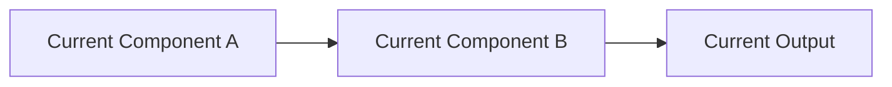
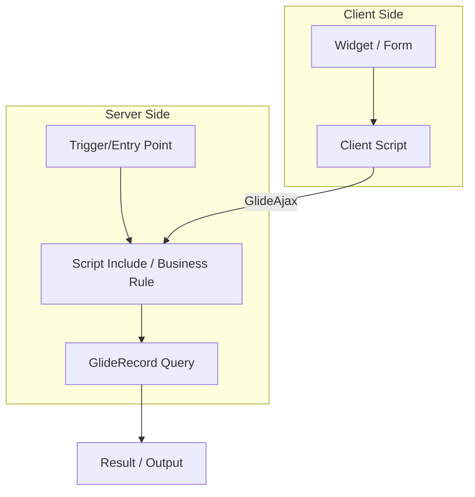
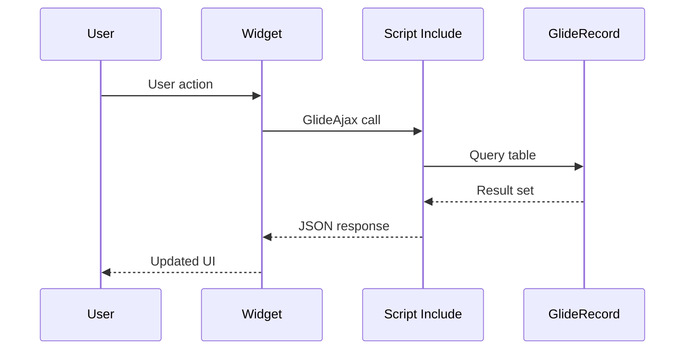

# Detailed Design Document — Template

Use this template for technical architecture documentation. Produced before or during implementation to guide development and serve as a technical reference.

---

````markdown
# [Feature Name] — Detailed Design Document

> **Release:** [X.X]  
> **Date:** [Month Day, Year]  
> **Author:** [Name]  
> **Status:** [Draft | In Review | Approved | Implemented]  
> **Instance:** [{instance_name}]  
> **Scope:** [sn_hr_core | {custom_scope} | global]  

---

## 1. Overview

### 1.1 Purpose

[One paragraph describing the feature/change and its business goal.]

### 1.2 Scope

**In Scope:**
- [Item 1]
- [Item 2]

**Out of Scope:**
- [Item 1 — reason]
- [Item 2 — reason]

### 1.3 Related Stories

| Story # | Title | Status |
|---------|-------|--------|
| [###] | [Title] | [Planned | In Progress | Complete] |

---

## 2. Current State

### 2.1 Current Architecture

[Describe how the system works today. Include a diagram if helpful.]



### 2.2 Known Issues

| Issue | Impact | Addressed in Design? |
|-------|--------|---------------------|
| [Issue 1] | [Impact] | Yes / No |

---

## 3. Proposed Design

### 3.1 Architecture Overview

[Describe the target architecture. Show how components interact.]



### 3.2 Component Design

#### [Component 1 — e.g., Script Include]

| Property | Value |
|----------|-------|
| **Name** | [PascalCase name] |
| **Table** | `sys_script_include` |
| **Scope** | [scope] |
| **Client Callable** | [Yes / No] |

**Public API:**

| Method | Parameters | Returns | Description |
|--------|-----------|---------|-------------|
| `methodName()` | `param1` (string), `param2` (boolean) | `string \| null` | [What it does] |

**Pseudocode:**
```
FUNCTION methodName(param1, param2)
    VALIDATE inputs
    QUERY table WHERE condition
    IF found THEN
        PROCESS result
        RETURN value
    ELSE
        LOG warning
        RETURN null
    END IF
END FUNCTION
```

#### [Component 2 — e.g., Business Rule]

| Property | Value |
|----------|-------|
| **Name** | `[Table] - [When] - [Action]` |
| **Table** | [table_name] |
| **When** | [Before / After / Async / Display] |
| **Insert/Update/Delete/Query** | [✓ / ✗ for each] |
| **Condition** | [encoded query or description] |

#### [Component 3 — e.g., Widget]

| Property | Value |
|----------|-------|
| **Name** | [Widget name] |
| **ID** | [widget_id] |
| **Page** | [sp_page] |

**Data Contract (Server → Client):**

| `data.*` Property | Type | Source |
|-------------------|------|--------|
| `data.items` | Array | GlideRecord query |
| `data.filter` | String | Encoded query from personas |
| `data.gql` | Object | `QueryRepo().getQueriesByName()` |

---

## 4. Data Model

### 4.1 Tables Affected

| Table | Action | Fields Added/Modified |
|-------|--------|----------------------|
| `[table_name]` | [New / Modified] | [field1, field2] |

### 4.2 New Fields

| Table | Field | Type | Max Length | Default | Mandatory |
|-------|-------|------|-----------|---------|-----------|
| [table] | [field_name] | [String/Reference/Boolean] | [40] | [value] | [Yes/No] |

### 4.3 Data Flow



---

## 5. Security Design

### 5.1 Roles Required

| Role | Purpose | New/Existing |
|------|---------|-------------|
| `[role_name]` | [What it grants] | [New / Existing] |

### 5.2 ACLs

| Table | Operation | Condition | Required Role |
|-------|-----------|-----------|---------------|
| [table] | [Read/Write/Create/Delete] | [condition] | [role] |

### 5.3 Security Considerations

- [ ] PII fields identified and protected
- [ ] Row-level filtering via Before Query Business Rule (if needed)
- [ ] Cross-scope access validated
- [ ] Input validation on all user-supplied parameters
- [ ] No hardcoded sys_ids

---

## 6. Integration Points

<!-- Remove this section if no external integrations -->

| System | Direction | Protocol | Authentication |
|--------|-----------|----------|---------------|
| [System name] | [Inbound / Outbound] | [REST / SOAP / Import Set] | [OAuth / Basic / MID Server] |

---

## 7. Configuration & Properties

| Property | Value | Description |
|----------|-------|-------------|
| `[property.name]` | [default value] | [What it controls] |

---

## 8. Deployment Plan

### 8.1 Update Sets

| Update Set Name | Scope | Contents |
|-----------------|-------|----------|
| `[name]` | [scope] | [What's included] |

### 8.2 Deployment Order

1. Deploy `[update_set_1]` — [reason for order]
2. Deploy `[update_set_2]`
3. Manual step: [configuration action]

### 8.3 Post-Deployment Steps

> ⚠️ **Manual Steps Required**
>
> 1. [Step 1]
> 2. [Step 2]

---

## 9. Rollback Plan

| Step | Action | Verification |
|------|--------|-------------|
| 1 | [Revert update set] | [How to verify] |
| 2 | [Restore configuration] | [How to verify] |

**Rollback Risk Level:** [Low | Medium | High]

---

## 10. Testing Strategy

### 10.1 Unit Tests

| Test | Input | Expected Output |
|------|-------|----------------|
| [Test name] | [Input data] | [Expected result] |

### 10.2 Integration Tests

| Scenario | Steps | Expected Result |
|----------|-------|----------------|
| [Scenario] | [1. Step, 2. Step] | [Result] |

### 10.3 User Acceptance Criteria

- [ ] [Acceptance criterion 1]
- [ ] [Acceptance criterion 2]
- [ ] [Acceptance criterion 3]

---

## 11. Appendix

### 11.1 Decision Log

| Decision | Options Considered | Chosen | Rationale |
|----------|-------------------|--------|-----------|
| [Decision point] | [Option A, Option B] | [Chosen] | [Why] |

### 11.2 References

- [Related documentation](../path/to/doc.md)
- ServiceNow Docs: [topic]
````

---

## Section Guidelines

| Section | Required | When to Include |
|---------|----------|-----------------|
| 1. Overview | Always | Every design document |
| 2. Current State | When modifying existing behavior | Skip for greenfield features |
| 3. Proposed Design | Always | Core of the document |
| 4. Data Model | When tables/fields change | Skip for script-only changes |
| 5. Security Design | Always | Even if "no new roles needed" |
| 6. Integration Points | When external systems involved | Skip for internal-only changes |
| 7. Configuration | When system properties used | Skip if none |
| 8. Deployment Plan | Always | Every design document |
| 9. Rollback Plan | Always | Every design document |
| 10. Testing Strategy | Always | Every design document |
| 11. Appendix | When applicable | Decision log captures "why" |
