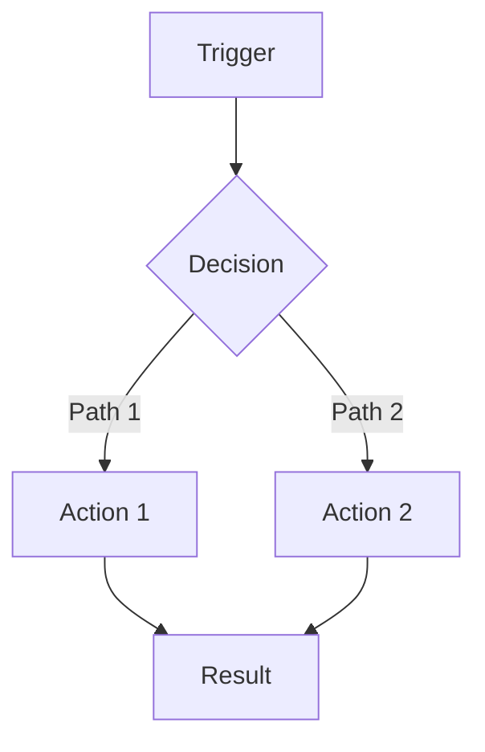

# Story Implementation Report — Template

Use this template for documenting completed story implementations. This is the primary technical knowledge base document.

---

````markdown
# [Story Title] — Story #[Number] Implementation

> **Story:** [Story Title]  
> **Release:** [X.X]  
> **Date Implemented:** [Month Day, Year]  
> **Instance:** [{instance_name}]  
> **Update Set(s):** `[update_set_name]`  
> **Scope:** [sn_hr_core | {custom_scope} | global]  
> **Author:** [Name]  

---

## Summary

| Field | Value |
|---|---|
| **Update Set** | `[name]` |
| **Scope** | [scope] |
| **Instance** | [instance] |
| **Date** | [date] |
| **Type** | [New Feature | Bug Fix | Enhancement | Configuration] |

---

## Problem Statement

[Describe the business problem or user pain point. Include:]
- What the user was experiencing
- What the expected behavior should be
- Business impact of the issue (if applicable)

---

## Root Cause Analysis

<!-- Include this section for bug fixes. Remove for new features. -->

| Issue | Root Cause |
|---|---|
| [Symptom 1] | [Technical root cause] |
| [Symptom 2] | [Technical root cause] |

---

## Solution Implemented

### Changes Made

[High-level summary of the solution approach. Explain the "why" behind the architecture decision.]

- [Change 1]
- [Change 2]
- [Change 3]

### Artifacts Modified

| Artifact | Table | Change Description |
|----------|-------|-------------------|
| **[Name]** | `[sys_script_include]` | [Description] |
| **[Name]** | `[sys_script]` | [Description] |

### Files Modified

```
{instance}/{scope}/{table}/
├── [artifact1].script.js      ← [description]
├── [artifact2].client_script.js ← [description]
└── [artifact3].template.html   ← [description]
```

---

## Technical Details

### [Section Title — e.g., "Data Flow", "Logic Changes", "API Changes"]

[Explain the technical implementation. Include relevant code snippets:]

```javascript
// ✅ Corrected implementation
var gr = new GlideRecord('table_name');
gr.addQuery('field', 'value');
gr.setLimit(1);
gr.query();
if (gr.next()) {
    // Process record
}
```

### Logic Flow

<!-- Use Mermaid for complex flows -->



---

## Bugs Fixed

<!-- Include for bug fix stories. Remove for new features. -->

| # | Bug | Fix |
|---|---|---|
| 1 | [Bug description] | [How it was fixed] |
| 2 | [Bug description] | [How it was fixed] |

---

## Configuration Changes

<!-- Include when manual ServiceNow configuration is required -->

> ⚠️ **Manual Step Required**
>
> [Describe what needs to be configured in ServiceNow manually]
> 1. Navigate to **[module path]**
> 2. [Step 2]
> 3. [Step 3]

---

## Dependencies

- [ ] Depends on Story #[XX] — [Title]
- [ ] Requires update set `[name]` deployed first
- [ ] N/A — No dependencies

---

## Rollback Plan

1. [Step 1 — e.g., "Revert update set `name`"]
2. [Step 2 — e.g., "Restore previous version of artifact"]
3. [Step 3 — e.g., "Verify rollback in affected module"]

**Rollback Risk Level:** [Low | Medium | High]

---

## Test Scenarios

| # | Scenario | Expected Result | Status |
|---|----------|-----------------|--------|
| 1 | [Happy path] | [Expected outcome] | ⬜ |
| 2 | [Edge case] | [Expected outcome] | ⬜ |
| 3 | [Error case] | [Expected outcome] | ⬜ |
| 4 | [Persona/role test] | [Expected outcome] | ⬜ |

---

## Out of Scope / Future Considerations

> [Document what was considered but deferred, and why]

- [Item 1 — deferred because...]
- [Item 2 — potential improvement for...]

---

## Related Documentation

- [Related story doc](../path/to/doc.md)
- [Design document](../path/to/design.md)
````

---

## Section Guidelines

| Section | Required | When to Include |
|---------|----------|-----------------|
| Summary | Always | Every report |
| Problem Statement | Always | Every report |
| Root Cause Analysis | Bug fixes only | When fixing existing behavior |
| Solution Implemented | Always | Every report |
| Technical Details | Always | Every report |
| Bugs Fixed | Bug fixes only | When listing specific bugs |
| Configuration Changes | When needed | Manual steps required post-deployment |
| Dependencies | Always | Even if "N/A" |
| Rollback Plan | Always | Every report |
| Test Scenarios | Always | Every report |
| Out of Scope | When applicable | When items were deferred |
